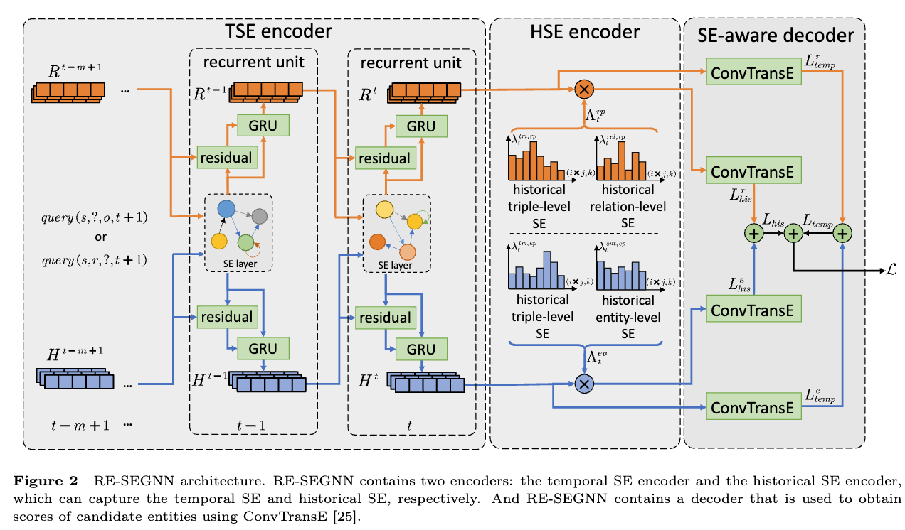

Implementation of Recurrent Semantic Evidence-aware Graph Neural Network.



## requirement

```txt
torch==1.12.0
torchvision==0.13.0
dgl-cuda117==0.9.0
numpy==1.22.3
tqdm
pandas
rdflib
```

## preparation

Open the folder of the project:

```bash
cd RESEGNN
```

Unzip the compressed data package:

```bash
tar -zxvf data.tar.gz
```

## get history semantic evidence

Get HSE of datasets:

```bash
python get_history.py --dataset ICEWS14 --method time_hawk_edge_2 --num-workers 8
```

 `ICEWS14` can be replaced with `ICEWS18`, `YAGO`, `WIKI`, `GDELT`, `ICEWS05-15`. `--num-workers` is determined by the number of CPU cores.

## train temporal semantic evidence

All the following parameters are the best hyperparameter settings：

```bash
python main.py -d ICEWS14 --train-history-len 8 --test-history-len 8 --dilate-len 1 --lr 1e-3 --evaluate-every 1 --n-hidden 200 --self-loop --decoder convtranse_edge_parted --encoder uvrgcn --layer-norm --entity-prediction --relation-prediction --task-weight 0.7 --model resegnn --n-epochs 20 --sematic-rate 0.3 --add-static-graph --history-method time_hawk_edge_2-alpha1-beta1-k20 --gpu 0

python main.py -d ICEWS18 --train-history-len 10 --test-history-len 10 --dilate-len 1 --lr 1e-3 --evaluate-every 1 --n-hidden 200 --self-loop --decoder convtranse_edge_parted --encoder uvrgcn --layer-norm --entity-prediction --relation-prediction --task-weight 0.6 --model resegnn --n-epochs 20 --sematic-rate 0.3 --add-static-graph --history-method time_hawk_edge_2-alpha1-beta1-k40 --angle 12 --gpu 0

python main.py -d ICEWS05-15 --train-history-len 15 --test-history-len 15 --dilate-len 1 --lr 1e-3 --evaluate-every 1 --n-hidden 200 --self-loop --decoder convtranse_edge_parted --encoder uvrgcn --layer-norm --entity-prediction --relation-prediction --task-weight 0.7 --model resegnn --n-epochs 20 --sematic-rate 0.3 --add-static-graph --history-method time_hawk_edge_2-alpha1-beta1-k20 --gpu 0

python main.py -d WIKI --train-history-len 2 --test-history-len 2 --dilate-len 1 --lr 1e-3 --evaluate-every 1 --n-hidden 200 --self-loop --decoder convtranse_edge_parted --encoder uvrgcn --layer-norm --entity-prediction --relation-prediction --task-weight 0.6 --model resegnn --n-epochs 20 --sematic-rate 0.5 --history-method time_hawk_edge_2-alpha1-beta1-k80 --gpu 0

python main.py -d YAGO --train-history-len 1 --test-history-len 1 --dilate-len 1 --lr 1e-3 --evaluate-every 1 --n-hidden 200 --self-loop --decoder convtranse_edge_parted --encoder uvrgcn --layer-norm --entity-prediction --relation-prediction --task-weight 0.6 --model resegnn --n-epochs 20 --sematic-rate 0.5 --history-method time_hawk_edge_2-alpha1-beta1-k60 --gpu 0

python main.py -d GDELT --train-history-len 6 --test-history-len 6 --dilate-len 1 --lr 1e-3 --evaluate-every 1 --n-hidden 200 --self-loop --decoder convtranse_edge_parted --encoder uvrgcn --layer-norm --entity-prediction --relation-prediction --task-weight 0.7 --model resegnn --n-epochs 20 --sematic-rate 0.4 --history-method time_hawk_edge_2-alpha1-beta1-k20 --gpu 0 
```

## acknowledgement

The source codes take [RE-GCN](https://github.com/Lee-zix/RE-GCN) and [TiRGN](https://github.com/Liyyy2122/TiRGN/tree/main) as the backbone to implement our proposed method. 

